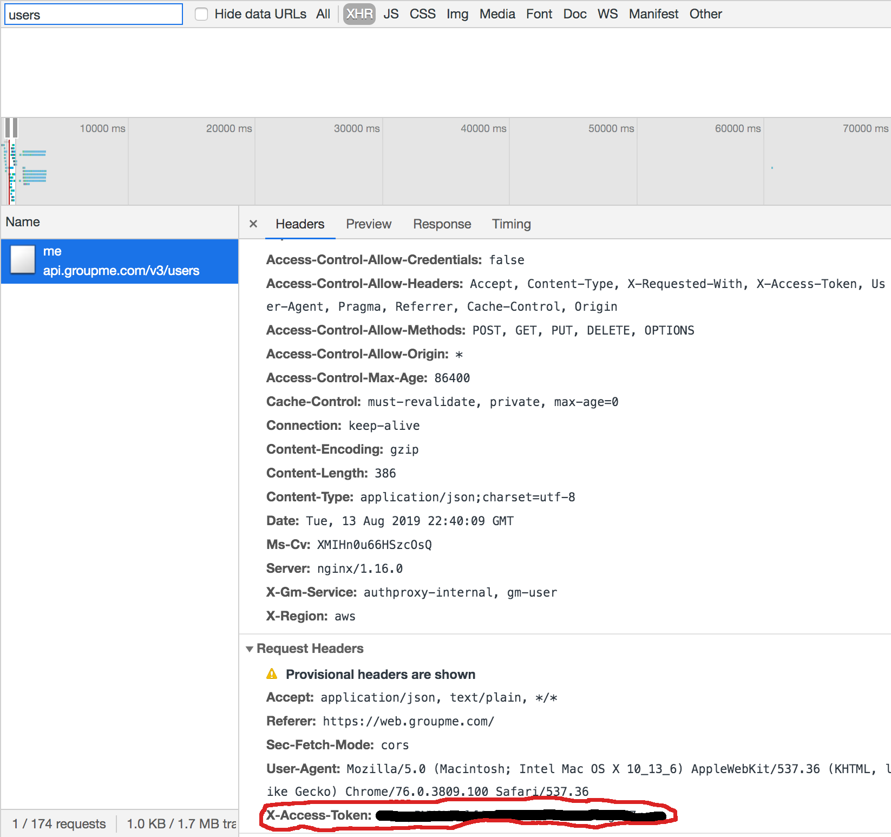

### GroupMe Scraper


##### To Use
* Obtain your access token
* * You can use [GroupMe's API](https://dev.groupme.com/applications/new) to create an Application and get an Access Key via Oauth2 OR just grab it from your browser (see below)
* Fetch Groups
```bash
yarn groups <ACCESS_TOKEN>
```
* Crawl and save all messages from a group
```bash
# group_id retrieved from previous step
yarn scrape <ACCESS_TOKEN> <GROUP_ID> 
```

**Your messages will be saved in out.json**

###### Obtaining your access token thru your browser
* Login to GroupMe
* Open up your Developer Tools and go to the network tab
* Reload the page, filter xhr requests by "user", and locate the request
* See under request headers, the Access Token parameter




